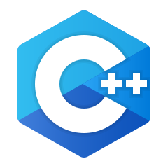

<div align="center">

<h1 align="center">Hi  I'm Kunal</h1><h4><i>DATA HAS A BETTER IDEA!!! just play with it...</i></h4>
</div>

---

<br>

✒️ __About me:__
- 📌 Data Consultant having a strong analytical ability, problem-solving skill, proficient in __AI-ML, Data Analytics, Data Science, Python, C++__, with overall 5.5+ years of industry experience in AI-ML and Data Analytics with Machine Learning and Deep Learning algorithms, Market Research, Statistics, GenAI use-cases, Multi-modal functionalities, LLM, GPT, Agents, RAG, AI tools. Also, I have exposure on end-to-end data pipelines with data processing, mapping, manipulating, validating, insights, preparation, modeling and dashboards on cloud stack. I like to learn new AI functionalities, data aspects and innovative research.

- 📌 Strong *analytical ability* with a passion for turning data into actionable insights, finding discoveries, hidden patterns, and solutions through it. I enjoy the journey with data, meeting new people, and hearing new perspectives

  ➤ Expertise in AI-ML techniques, Data Science, Python, Data Analytics, AI tools.<br>
  ➤ I enjoy the journey with data, new people, AI-ML keys, data pipelines, cloud.<br>
  ➤ Productive | Strategic thinker | Mentor | Motivated | Quick learner | Problem solver.<br>
  ➤ I like to play carrom, badminton, pianist.

- 📌 Connect with me and follow. Let's learn AI togather...

  <a href="https://www.linkedin.com/in/kunalkolhe3/"></a>
  <a href="https://github.com/kunalk3/"></a>
  <a href="https://mail.google.com/mail/?view=cm&fs=1&tf=1&to=kunalkoleh333@gmail.com" target="_blank"></a>
  <a href="https://www.facebook.com/kunal.kolhe98/"></a>
  <a href="https://www.instagram.com/kkunalkkolhe/"></a>
  <a href="https://www.google.com/maps/place/Pune,+Maharashtra/"></a>
  <a href="https://kunalk3.github.io/Portfolio-Website-Kunalk3/"></a>
  <br>


```
"Don't wait for opportunity, just create it."
```

---

✒️ __Tech Stack:__
<p align="right"> 
  <a href="https://www.python.org/" target="_blank"> </a>
  <a href="https://www.w3schools.com/cpp/" target="_blank"> </a>
  <a href="https://www.mysql.com/" target="_blank"> </a>
  <a href="https://www.java.com/en/" target="_blank"> </a>
  <a href="https://www.programiz.com/c-programming" target="_blank"> </a>
  <a href="https://nodejs.org/en" target="_blank"> </a>
  <a href="https://www.mongodb.com/" target="_blank"> </a>
  <a href="https://spark.apache.org/" target="_blank"> </a>
  <a href="https://html.com/" target="_blank"> </a>
  <a href="https://www.w3.org/Style/CSS/" target="_blank"> </a>
  <a href="https://getbootstrap.com/" target="_blank"> </a>
  <a href="https://www.qt.io/" target="_blank"> </a>
</p>
<p align="right">
  <a href="https://pandas.pydata.org/" target="_blank"> </a>
  <a href="https://numpy.org/" target="_blank"> </a>
  <a href="https://mlflow.org/" target="_blank"> </a>
  <a href="https:https://www.statsmodels.org/stable/index.html/" target="_blank"> </a>
  <a href="https://scipy.org/" target="_blank"> </a>
  <a href="https://www.tensorflow.org/" target="_blank"> </a>
  <a href="https://keras.io/" target="_blank"> </a>
  <a href="https://xgboost.readthedocs.io/en/stable/install.html" target="_blank"> </a>
  <a href="https://scikit-learn.org/" target="_blank"> </a>
  <a href="https://plotly.com/" target="_blank"> </a>
  <a href="https://www.nltk.org/" target="_blank"> </a>
  <a href="https://www.selenium.dev/" target="_blank"> </a>
  <a href="https://pytorch.org/" target="_blank"> </a> 
  <a href="https://radimrehurek.com/gensim/index.html" target="_blank"> </a>
  <a href="https://textblob.readthedocs.io/en/dev/" target="_blank"> </a> 
  <a href="https://spacy.io/" target="_blank"> </a> 
  <a href="https://opencv.org/" target="_blank"> </a> 
  <a href="https://www.dask.org/" target="_blank"> </a> 
  <a href="https://optuna.org/" target="_blank"> </a> 
  <a href="https://www.ray.io/" target="_blank"> </a> 
</p>
<p align="right"> 
  <a href="https://aws.amazon.com/" target="_blank"> </a>
  <a href="https://azure.microsoft.com/en-in" target="_blank"> </a>
  <a href="https://cloud.google.com/docs" target="_blank"> </a>
  <a href="https://flask.palletsprojects.com/en/stable/installation/" target="_blank"> </a>
  <a href="https://streamlit.io/" target="_blank"> </a>
  <a href="https://airflow.apache.org/" target="_blank"> </a>
  <a href="https://www.gradio.app/" target="_blank"> </a>
  <a href="https://cloud.google.com/composer" target="_blank"> </a>
</p>
<p align="right"> 
  <a href="https://www.anaconda.com/" target="_blank"> </a>
  <a href="https://jupyter.org/" target="_blank"> </a>
  <a href="https://www.jetbrains.com/pycharm/" target="_blank"> </a>
  <a href="https://colab.research.google.com/" target="_blank"> </a>
  <a href="https://code.visualstudio.com/" target="_blank"> </a>
  <a href="https://www.eclipse.org/" target="_blank"> </a>
  <a href="https://www.microsoft365.com/" target="_blank"> </a>
  <a href="https://www.atlassian.com/software/jira" target="_blank"> </a>
  <a href="https://spring.io/projects/spring-boot" target="_blank"> </a>
  <a href="https://git-scm.com/" target="_blank"> </a>
  <a href="https://www.atlassian.com/software/confluence" target="_blank"> </a>
  <a href="https://dvc.org/" target="_blank"> </a>
  <a href="" target="_blank"> </a>
</p>
<p align="right"> 
  <a href="https://openai.com/" target="_blank"> </a>
  <a href="https://ollama.com/" target="_blank"> </a>
  <a href="https://www.langchain.com/" target="_blank"> </a>
  <a href="https://docs.trychroma.com/docs/overview/introduction" target="_blank"> </a>
  <a href="https://huggingface.co/" target="_blank"> </a>
  <a href="https://huggingface.co/" target="_blank"> </a>
  <a href="https://platform.openai.com/docs/overview" target="_blank"> </a> 
  <a href="https://platform.openai.com/docs/overview" target="_blank"> </a>
  <a href="https://ai.google.dev/gemini-api/docs" target="_blank"> </a>
  <a href="https://www.langchain.com/langgraph" target="_blank"> </a>
  <a href="https://www.langchain.com/langgraph" target="_blank"> </a>
  <a href="https://www.meta.ai/" target="_blank"> </a>
  <a href="https://claude.ai/" target="_blank"> </a>
  <a href="https://www.perplexity.ai/" target="_blank"> </a>
  <a href="https://www.langchain.com/" target="_blank"> </a>
</p>

---

✒️ __Connect with me:__
<p align="left">
  <a href="https://linkedin.com/in/kunalkolhe3" target="blank"></a>
  <a href="https://github.com/kunalk3/" target="blank"></a>
  <a href="https://fb.com/kunal.kolhe.98" target="blank"></a>
  <a href="mailto:kunalkolhe333@gmail.com" target="blank"></a>
  <a href="https://instagram.com/kkunalkkolhe" target="blank"></a>
  <a href="https://www.hackerrank.com/kunalkolhe333" target="blank"></a>
      <a href="https://kunalk3.github.io/Portfolio-Website-Kunalk3/" target="blank"></a>
  
  <b>[Portfolio](https://kunalk3.github.io/Portfolio-Website-Kunalk3/) |</b> Own by Kunal K
</p>

---

✒️ __Profile info:__


<p> 


<div align="left">

</div>
